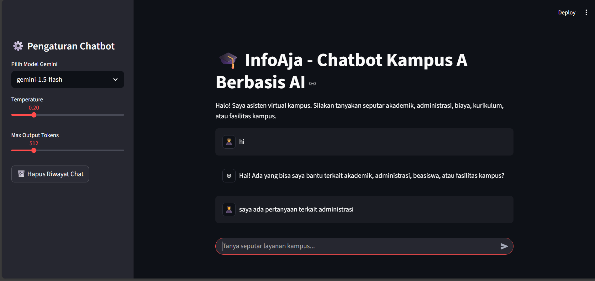

# 🎓 InfoAja – Chatbot Pelayanan Kampus Berbasis AI

**InfoAja** adalah chatbot interaktif berbasis **LangChain**, **Google Gemini**, dan **Streamlit** yang dirancang untuk membantu mahasiswa mendapatkan informasi terkait layanan kampus.  
Chatbot ini memberikan jawaban cepat seputar akademik, administrasi, biaya kuliah, beasiswa, kurikulum, hingga fasilitas kampus.

---

## ✨ Fitur Utama
- 💬 **Chatbot Interaktif** dengan antarmuka web Streamlit.  
- 🧠 **Integrasi LLM (Google Gemini)** untuk memahami pertanyaan mahasiswa.  
- 📚 **Knowledge Base Dummy** (contoh data Kampus A):  
  - Jurusan: Teknik Industri & Teknik Informatika.  
  - Biaya: Semester & PMB.  
  - Beasiswa, fasilitas kampus, kontak, dan kurikulum per jurusan.  
- 🔒 **Batasan Topik** – chatbot hanya menjawab seputar layanan kampus.  
- 📝 **Memory Percakapan** – riwayat percakapan disimpan agar konteks terjaga.  
- ⚙️ **Pengaturan Model** – pilih model Gemini, atur temperature, dan token output.  



Demo Aplikasi bisa diakses pada link: https://hackactive-finalproject-infoaja.streamlit.app/

---

## 🛠️ Teknologi
- [Streamlit](https://streamlit.io/) – UI Web sederhana dan interaktif.  
- [LangChain](https://www.langchain.com/) – framework integrasi LLM.  
- [Google Generative AI (Gemini)](https://ai.google.dev/) – model LLM.  
- [Python-dotenv](https://pypi.org/project/python-dotenv/) – untuk menyimpan API Key.  

---

## 📂 Struktur Proyek
📦 infoaja
├── app.py # Script utama Streamlit
├── kampus_info.json # Knowledge base dummy Kampus A
├── .env # API Key Google Gemini
├── requirements.txt # Dependensi Python
└── README.md # Dokumentasi


---

## 🚀 Cara Menjalankan

1. Clone repositori
```bash
git clone https://github.com/Sintasitinuriah/Final_Project_LLM.git
cd Final_Project_LLM
```

2. Buat virtual environment & install dependensi
```bash
python -m venv venv
source venv/bin/activate   # Linux/Mac
venv\Scripts\activate      # Windows

pip install -r requirements.txt

```

3. Tambahkan API Key Google Gemini

Buat file .env di root folder:
```bash
GOOGLE_API_KEY=your_api_key_here
```

4. Jalankan aplikasi
```bash
streamlit run streamlit_chatbot.py
```
Akses di browser: http://localhost:8501

---
## 📘 Contoh Pertanyaan

- "Apa saja jurusan di Kampus A?"
- "Berapa biaya semester di Kampus A?"
- "Tolong jelaskan kurikulum Teknik Industri."
- "Apakah ada beasiswa di Kampus A?"
- "Fasilitas apa saja yang tersedia di Kampus A?"
---

## 🔮 Roadmap

- Integrasi dengan database kampus asli.
- Multi-kampus support.
- Login mahasiswa & personalisasi layanan.
- Chat history dengan penyimpanan eksternal (SQLite / Firebase).
- Integrasi voice chat.

---

🤝 Kontribusi

Pull request sangat terbuka! Silakan fork, buat branch fitur, lalu ajukan PR.

---
📜 Lisensi

MIT License © 2025 – InfoAja